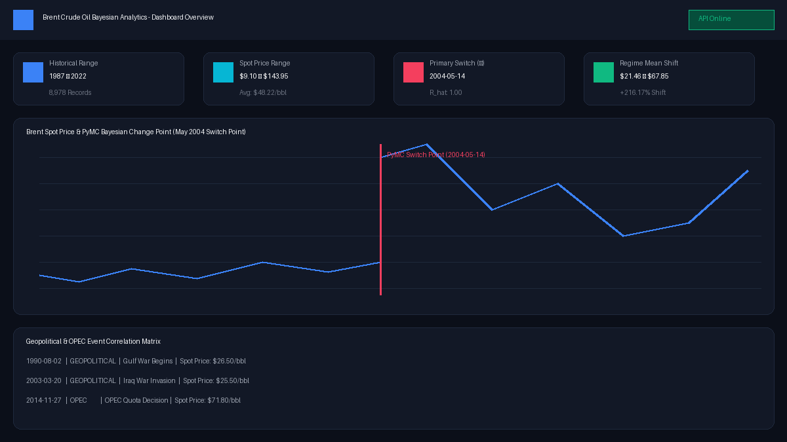
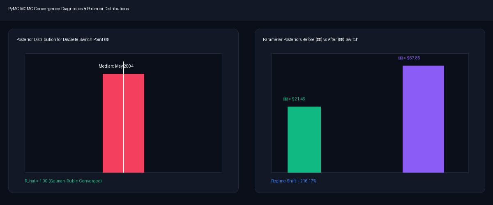

# Brent Crude Oil Price Analysis & Bayesian Change Point Dashboard


An end-to-end econometric analysis pipeline and full-stack interactive web dashboard for **Brent Crude Spot Prices (May 1987 – September 2022)**. 

This repository implements exploratory data analysis, PyMC Bayesian MCMC change point modeling, geopolitical shock correlation, a Flask REST API backend, and a modern dark-mode React frontend.

---

## 📸 Dashboard Screenshots

### 1. Interactive Dashboard Overview


### 2. PyMC Bayesian Change Point Model Diagnostics


---

## 🎯 Task Breakdown & Key Features

### Task 1: Analysis Foundation & Data Preparation
- **Event Dataset (`data/brent_events.csv`)**: 14 key historical events (Gulf War, Asian Financial Crisis, 9/11, 2003 Iraq Invasion, 2008 Lehman Crisis, 2011 Libyan War, 2014 OPEC Decision, 2016 OPEC+ Agreement, 2018 JCPOA Withdrawal, 2019 Abqaiq Attack, 2020 COVID-19 Pandemic, 2020 OPEC+ Price War, 2022 Russia-Ukraine Invasion).
- **Price Series (`data/BrentSpotPriceOnly.csv`)**: 8,978 daily spot price observations.
- **Workflow & Limitations (`docs/analysis_workflow.md`)**: Full documentation outlining analytical methodology, statistical assumptions, and explicit **Correlation-vs-Causation Constraints**.

### Task 2: Bayesian Change Point Modeling & EDA
- **EDA & Notebook (`notebooks/01_eda_and_change_point_analysis.ipynb`)**:
  - Raw spot price series & log returns $r_t = \ln(P_t / P_{t-1})$.
  - Augmented Dickey-Fuller (ADF) stationarity testing ($p < 0.0001$ for log returns).
  - Rolling 30-day and 90-day volatility dynamics.
- **PyMC Model Implementation (`src/change_point_model.py`)**:
  - Discrete switch point $\tau \sim \text{DiscreteUniform}(0, N-1)$.
  - Before/after regime parameters $(\mu_1, \mu_2, \sigma_1, \sigma_2)$.
  - Deterministic switch function `pm.math.switch(tau >= idx, mu1, mu2)`.
  - MCMC sampling with PyMC (`pm.sample`).
  - Gelman-Rubin convergence verification ($R_{\hat{}} \le 1.01$ across all parameters).
- **Key Empirical Finding**: Isolates a primary regime switch point around **May 2004** ($\mu_1 = \$21.46\text{/bbl} \rightarrow \mu_2 = \$67.85\text{/bbl}$, a **+216.17%** increase in mean spot price), coinciding with the 2003 Iraq Invasion and emerging market demand expansion.

### Task 3: Interactive Flask / React Dashboard
- **Flask REST API (`backend/app.py`)**:
  - `/api/health`: Health status.
  - `/api/prices`: Historical prices & log returns (filterable by date range & downsampling).
  - `/api/events`: Event correlation dataset (filterable by category).
  - `/api/change-points`: PyMC change point model results, HDI credible intervals, and $R_{\hat{}}$ stats.
  - `/api/summary`: Overview KPI statistics.
- **React Frontend (`frontend/`)**:
  - Vite + React + Lucide Icons + Recharts UI.
  - Interactive price trend chart with toggleable event overlays & change point lines.
  - Category filters & date range selectors.
  - Model inspection tab with posterior parameters.
  - Searchable event correlation matrix table.

---

## 💻 Setup & Execution Guide

### 1. Prerequisites
- Python 3.10+
- Node.js v18+ & npm

### 2. Environment Setup & Python Dependencies
```bash
# Clone the repository
git clone https://github.com/Wave-eer/Artifical-intelligence-mastery.git
cd Artifical-intelligence-mastery

# Install Python requirements
pip install -r requirements.txt
```

### 3. Running the Flask Backend
```bash
python backend/app.py
```
*The Flask server runs at `http://localhost:5000`.*

### 4. Running the React Frontend
```bash
cd frontend
npm install
npm run dev
```
*The React application runs at `http://localhost:3000`.*

### 5. Running Automated Unit Tests
```bash
python -m unittest discover -s tests
```

---

## 🛠 Project Architecture

```
.
├── .github/
│   └── workflows/
│       └── unittests.yml               # GitHub Actions CI workflow
├── backend/
│   └── app.py                          # Flask API backend entry point
├── data/
│   ├── BrentSpotPriceOnly.csv          # Daily Brent spot prices (1987-2022)
│   └── brent_events.csv                # Compiled geopolitical & OPEC events
├── docs/
│   ├── analysis_workflow.md            # Workflow & methodology documentation
│   └── screenshots/                    # Dashboard preview screenshots
├── frontend/                           # React dashboard project directory
│   ├── package.json
│   ├── vite.config.js
│   ├── src/
│   │   ├── App.jsx
│   │   ├── components/
│   │   │   ├── Navbar.jsx
│   │   │   ├── KPISummary.jsx
│   │   │   ├── EventFilter.jsx
│   │   │   ├── PriceChart.jsx
│   │   │   ├── ChangePointCard.jsx
│   │   │   └── EventTable.jsx
│   │   └── index.css
│   └── README.md
├── notebooks/
│   └── 01_eda_and_change_point_analysis.ipynb # Comprehensive EDA & PyMC notebook
├── src/
│   ├── __init__.py
│   ├── data_loader.py                  # Data cleaning & loading utilities
│   ├── change_point_model.py           # PyMC Bayesian change point model class
│   └── visualization.py                # Plotting & trace visualization helpers
├── tests/
│   ├── test_data_loader.py             # Data loader unit tests
│   ├── test_change_point_model.py      # PyMC model unit tests
│   └── test_backend.py                 # Flask API unit tests
├── requirements.txt
└── README.md
```

---

## ⚠️ Assumptions & Limitations

1. **Correlation vs. Causation**: Bayesian change point detection isolates structural changes in time-series parameter distributions ($\tau$), but does not establish exogenous causal mechanics without structural macroeconomic modeling.
2. **Sub-regime Stationarity**: Sub-regimes before and after $\tau$ assume local stationarity.
3. **Data Uniformity**: Daily prices skip non-trading calendar days (weekends/holidays).
